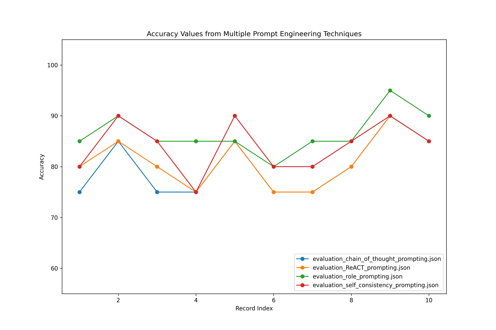
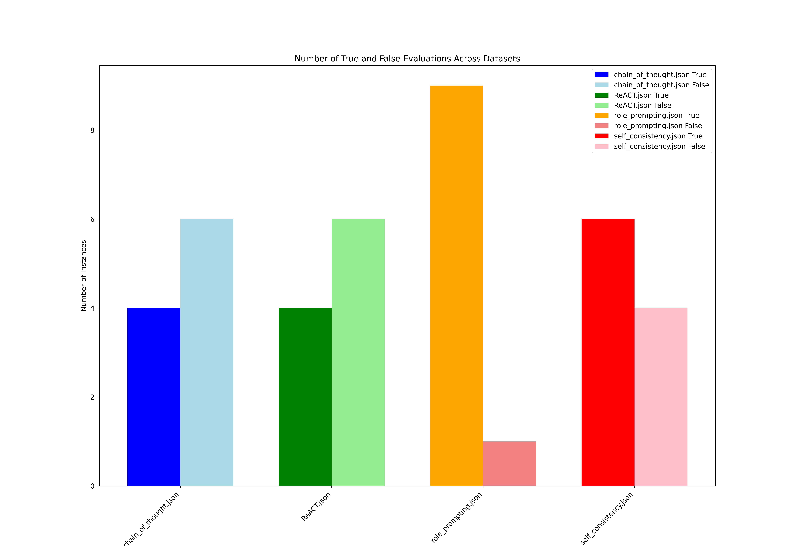

# RAG-Evaluation
In this project I evaluated the output of a vectorRAG using reflection agent strategy and different prompt engineering techniques including role prompting, chain of thought, ReAct and self consistency

# Prompt Engineering Evaluation

This project focuses on evaluating AI responses using prompt engineering techniques. 
It involves two main components: Generation and Evaluation. The Generation component
retrieves answers using data from a VectorDatabase, while the Evaluation
component assesses the accuracy of these answers using various prompt engineering techniques.

## Project Overview

### Data Collection

Data was collected from three articles related to prompt engineering. This data was then chunked and stored in a VectorDatabase (Faiss) for efficient retrieval.

### Test Data Creation

After data collection, the next step is to create a test set. This is done using the Giskard library, which helps in generating a structured test set for evaluating AI responses. Here is an example of first record in test set:
- **Questions:** What is the purpose of incorporating knowledge in prompt engineering?.
- **Actual Answers:** Incorporating knowledge or information in prompt engineering enhances the model’s prediction accuracy. By providing relevant knowledge or information related to the task at hand, the model can leverage this additional context to make more accurate predictions. This technique enables the model to tap into external resources or pre-existing knowledge to improve its understanding and generate more informed responses.


### 1. Generation

The Generation component uses a retrieval prompt from `prompt.py` in conjunction with data stored in the VectorDatabase (Faiss) to generate answers to user questions.

### 2. Evaluation

The Evaluation component employs four different prompt engineering techniques:
- **Chain of Thought**
- **React**
- **Role Prompting**
- **Self-Consistency**

It evaluates the AI-generated answers by comparing them to actual answers from the test set. The evaluation process provides an accuracy measure and feedback explaining the results.


## Installation

To set up this project, follow these steps:

1. Clone the repository:
    ```bash
    git clone https://github.com/harrisonsrp/RAG-Evaluation
    cd https://github.com/harrisonsrp/RAG-Evaluation
    ```
2. Install the required dependencies:

    ```bash
    pip install poetry
    ```

    ```bash
    poetry install 
    ```

3. Set up the VectorDatabase (Faiss) and ensure you have the necessary test data.

## Usage

1. **Build Vector Database:**
   Run the ingestion.py to collect data and save embedded vector.

2. **Build test set:**
    from test_data folder, run create_test_set.py to create test-set.jsonl

3. **Generate and Evaluate the Answer:**
   Run main.py to iterate through all 10 questions in the test set and use them as input
    for generation agent. Then the output of generation agent along with question and Actual
    answer will be use as input of RAG_eval() function to run the evaluation agent.

## Output
Here you can see the output of evaluation agent for the first question of test set based 4 different prompts:

- **Question:**
    What is the purpose of incorporating knowledge in prompt engineering?
- **Actual Answer:**
    Incorporating knowledge or information in prompt engineering enhances the model’s prediction accuracy. By providing relevant knowledge or information related to the task at hand, the model can leverage this additional context to make more accurate predictions. This technique enables the model to tap into external resources or pre-existing knowledge to improve its understanding and generate more informed responses
- **AI Answer:**
Incorporating knowledge in prompt engineering enhances the quality of responses by guiding AI models to provide not just answers, but also relevant context and insights. This leads to more informative and meaningful interactions, improving user experience and understanding.
- **Evaluation using Chain of Thought:**
The student's answer correctly identifies that incorporating knowledge enhances the quality of responses and improves user experience. However, it lacks emphasis on the model's prediction accuracy and the importance of leveraging external resources or pre-existing knowledge, which are key components of the actual answer. This omission affects the completeness and correctness of the response.

- **Evaluation using ReAct:**
The student's answer correctly identifies that incorporating knowledge enhances the quality of responses and improves user experience. However, it lacks emphasis on the specific aspect of prediction accuracy and the importance of leveraging external resources or pre-existing knowledge, which are key components of the actual answer. This omission affects the completeness of the response, leading to a lower evaluation percentage.
- **Evaluation using Role Prompting:**
The student's response accurately captures the essence of incorporating knowledge in prompt engineering by emphasizing the enhancement of response quality and user experience. However, it lacks specific mention of prediction accuracy and the model's ability to leverage external resources, which are key aspects of the actual response.
- **Evaluation using Self Consistency:**
The student's answer captures the essence of enhancing the quality of responses through knowledge incorporation, but it lacks specific mention of prediction accuracy and the model's ability to leverage external resources. The initial evaluation was slightly optimistic, but upon reevaluation, it became clear that the answer did not fully align with the actual answer's emphasis on prediction accuracy and context utilization
## Results

This plot showing the accuracy of the four prompt engineering techniques. Each technique is represented by a separate line in the plot, with 10 data points in the X axis corresponding 
to test data index value and accuracy values in the Y axis.


For the accuracy more than 85% and above percent, the evaluation agent consider response as True
and False for less than 85%. In this bar plot you can see the count of  true and false for evaluation result 
based on each prompt engineering techniques
Count of True or False


## Contributing

Contributions are welcome! Please submit a pull request or open an issue if you have suggestions or improvements.


## Acknowledgements

- [Faiss](https://github.com/facebookresearch/faiss) for the VectorDatabase.
- [Giskard](https://github.com/giskard-ai/giskard) for creating the test set.


